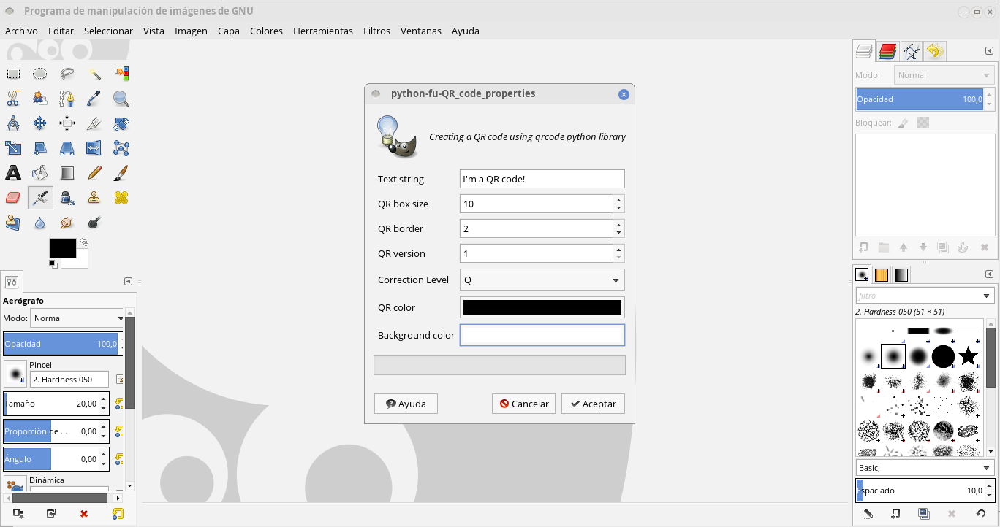

# gimp-qrcode

A Python-Fu Gimp plug-in for QR creation using qrcode library

## TODO list:

- Implement a new "imagefactory" based only on GIMP functions for the qrcode library. In order to avoid Pillow.
- "Logo in the middle" coustomization.
- Study further techniques of marging logos into the QR code. 
